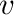
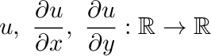
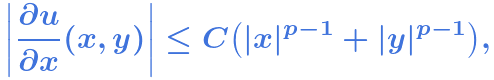
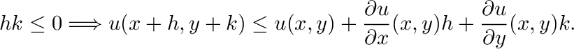
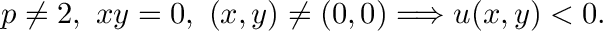

# The Burkholder Martingale Transform Inequality in Lean

Daniel Smania  
ICMC-USP, Sao Carlos-SP, Brazil  
<daniel.smania@gmail.com>  
<https://smaniad.github.io/HomePage/>

## Overview

This repository proves the *Burkholder inequality for the real-valued martingale transforms* in the Lean proof assistant, as stated in `MartingaleTransforms.lean` and Figure 1.

That is the **Burkholder inequality for the real-valued martingale transforms** (Burkholder 1985).

**Theorem.** Let . Let  be a measurable space, and let  be a finite measure on . Let  be a filtration indexed by , and let

be measurable functions such that  is a discrete martingale with respect to . Moreover

Suppose that  is a predictable sequence with respect to  with

Then, for every ,

where  is the martingale transform of  with respect to  and .

See Banuelos and Davis 2011 for more information on this interesting result.

## The Burkholder Function 

The proof follows Burkholder 1985. The main step there and the analytic heart of the formalization is to prove that the function

has a majorant  satisfying the theorem in Figure 2 and as stated in `Majorant.lean`. That is,

**Theorem** (Burkholder 1985). Let  with . Then there exist

and a constant  such that:

A. The functions

are continuous on .

B. For all ,

C. We have

D. We have

E. We have

F. We have

## An Informal Report On How The Formalization Was Done

The proof of Theorem 2 is particularly painful to formalize in Lean. The function  is given explicitly in Burkholder 1985, but it is defined piecewise on several sectors of . Although the argument proving Theorem 2 in Burkholder 1985 occupies only about half a page, is fairly simple, and could be followed by an undergraduate student with a solid background in point-set topology and analysis, a fully manual formalization would probably require several weeks of work, as Codex itself suggested to me, and perhaps even months.

In our case, the formalization became feasible within a manageable amount of time, namely a few days, by using AI tools such as Copilot and Codex in *agent mode*. In practice, we barely had to type any Lean code ourselves; instead, we mostly guided the agent when necessary.

We began by attaching a LaTeX file to Codex containing the main steps of the proof, following Burkholder 1985, and asking it to encode the argument in Lean. This worked reasonably well for the main definitions. We then suggested, in colloquial language, possible strategies for the proof, using classical gluing lemmas from topology and concavity criteria from analysis. Occasionally, we still had to type small pieces of code or provide more precise guidance, especially when the proof required Mathlib-specific formulations.

Agent mode was particularly useful for debugging problems caused by changes in notation or API differences between versions of Mathlib. The cycle of correction, compilation, and further correction became much faster in agent mode, avoiding the repeated copy-paste-compile workflow that was typical of pre-agent AI tools.

Another interesting feature is that ChatGPT has recently started to suggest additional information after answering a question, apparently in an attempt to keep the user engaged. This can be rather annoying in ordinary ChatGPT sessions. However, when coding in Lean with Codex, it is often quite useful, since the model frequently suggests the next natural steps in the formalization.

A particularly annoying feature of Codex is that, after we suggest an approach to a proof, it often replies with something like "that is certainly the natural approach". As a result, it is difficult to know whether Codex really knew how to proceed, or whether it is simply agreeing too readily. At times, it sounds like an overly confident student who does not want to acknowledge that it needs help.

Unfortunately, even with the paid version of Codex, through ChatGPT Plus, together with the Codex extension for Visual Studio Code, we frequently ran out of credits every day. We therefore had to spend additional time purchasing extra credits and restarting sessions in different computing environments.

The result was more than 20,000 lines of Lean code. We believe that this code is unlikely to be optimal; nevertheless, it is remarkable that we barely had to write any proof by hand. Most of the work consisted in guiding the agent using colloquial language and image snapshots from Burkholder 1985. This is quite astonishing when compared with the capabilities of pre-agent AI tools only a few months ago.

## References

Burkholder, D. L. *An elementary proof of an inequality of R. E. A. C. Paley*. Bulletin of the London Mathematical Society 17, 474--478, 1985. DOI: <https://doi.org/10.1112/blms/17.5.474>.
